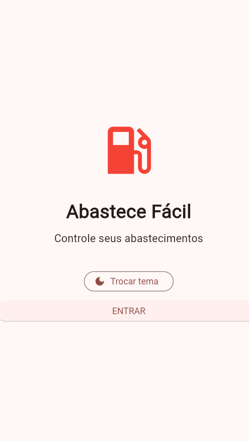
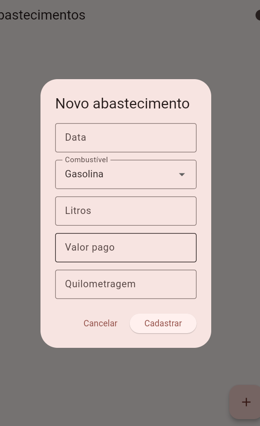
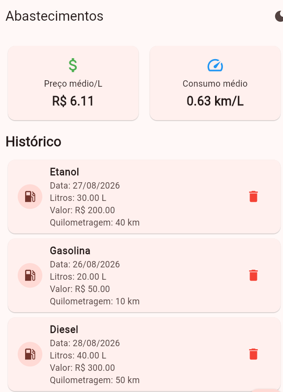
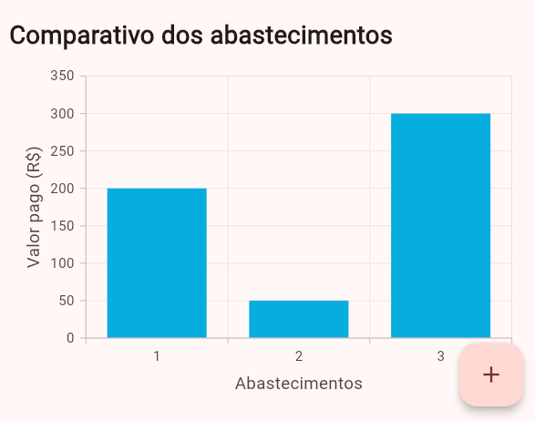

# ⛽ Histórico de Abastecimentos

Aplicativo desenvolvido para registrar e acompanhar o histórico de abastecimentos de um veículo, armazenando informações sobre a data, tipo de combustível, quantidade de litros abastecidos, valor pago e quilometragem do veículo.

O aplicativo também realiza cálculos para apresentar o **preço médio por litro** e o **consumo médio do veículo em km/L**, considerando a quilometragem e o abastecimento anterior.

## 📱 Título do App

**Histórico de Abastecimentos**

## 🛠️ Tecnologias

* **Flutter** — desenvolvimento do aplicativo mobile
* **Dart** — linguagem de programação


## 📋 Funcionalidades

* Registrar um novo abastecimento;
* Informar a data do abastecimento;
* Selecionar o tipo de combustível;
* Informar a quantidade de litros abastecidos;
* Informar o valor pago;
* Informar a quilometragem atual do veículo;
* Calcular o preço médio por litro;
* Calcular o consumo médio do veículo em km/L;
* Considerar o abastecimento anterior para calcular o consumo;
* Visualizar o histórico de abastecimentos;
* Armazenar os dados localmente no dispositivo.

## 💰 Cálculo do preço médio por litro

O preço por litro é calculado dividindo o valor pago pela quantidade de litros abastecidos:

**Preço por litro = valor pago ÷ litros abastecidos**

Por exemplo:

> Se foram abastecidos 40 litros e o valor pago foi R$ 240,00:
>
> **240 ÷ 40 = R$ 6,00 por litro**

## 🚗 Cálculo do consumo médio

O consumo do veículo é calculado considerando a diferença entre a **quilometragem atual e a quilometragem do abastecimento anterior**, dividida pela quantidade de litros abastecidos.

**Consumo médio = (quilometragem atual − quilometragem anterior) ÷ litros abastecidos**

Por exemplo:

> Quilometragem anterior: 10.000 km
> Quilometragem atual: 10.400 km
> Combustível abastecido: 40 litros
>
> **(10.400 − 10.000) ÷ 40 = 10 km/L**

Dessa forma, o aplicativo consegue estimar quantos quilômetros o veículo percorreu para cada litro de combustível.

## ▶️ Passos para testar

### 1. Clonar o repositório

git clone https://github.com/MIRELLA-02/AbastecimentoVeiculos.git


### 2. Acessar a pasta do projeto

cd nome-do-projeto


### 3. Instalar as dependências

flutter pub get


### 4. Executar o aplicativo

Com um dispositivo físico conectado ou um emulador aberto:


flutter run


### 5. Testar o aplicativo

1. Abrir o aplicativo;
2. Cadastrar um novo abastecimento;
3. Informar a data;
4. Selecionar o tipo de combustível;
5. Informar a quantidade de litros;
6. Informar o valor pago;
7. Informar a quilometragem atual;
8. Salvar o abastecimento;
9. Cadastrar um segundo abastecimento com uma quilometragem maior;
10. Verificar o preço por litro;
11. Conferir o consumo médio em km/L;
12. Consultar o histórico de abastecimentos.

## 🖼️ Prints das telas

### Tela inicial



### Cadastro de abastecimento



### Histórico de abastecimentos



### Comparativo de Abastecimentos




## 📦 Arquivo APK

O arquivo `.apk` está disponível na pasta:

```text
assets/
└── app-release.apk
```

## 📁 Estrutura do projeto

```text
📁 projeto
├── 📁 assets
│   ├── 📱 app-release.apk
│   ├── 🖼️ tela_inicial.png
│   ├── 🖼️ cadastro_abastecimento.png
│   ├── 🖼️ historico_abastecimentos.png
│   └── 🖼️ calculos_abastecimento.png
├── 📁 lib
├── 📄 pubspec.yaml
└── 📄 README.md
```

## 👩‍💻 Desenvolvimento

Projeto desenvolvido por Mirella Brolezi
